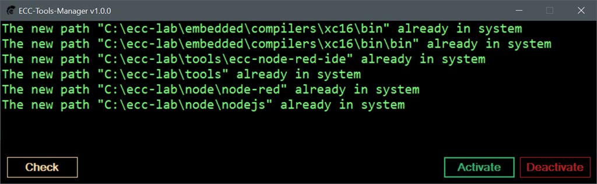

# ECC-CMDEX-RED

## What is the `ECC-CMDEX-RED`

The `ecc-cmdex-red` is a development toolkit used to develop `Internet-of-Things` and `Computer-based Control & Monitoring` applications. It provides many tools as Graphical User Interface Application, the Integrated Development Environment (IDE), for example,

- `Flow-based Editor` powered by `Node-RED`.

- `Dashboard` powered by `Node-RED Dashboard`.

- `Realistic 3D Interaction and Simulation` includes `LEDs`, `PSWs`, `POTs`, `Buzzer`, etc. All can be controlled by `Mouse` and `Keyboard`.

- `Real-time Realistic 3D Visualization` shows data sent from `hardware` side, the microcontroller.

- `Real-time Data Exchanging` with `Cmdex-based Microcontroller`.

- `Console Windows` for displaying all system information.

- `Controllable Layout`, the flexible working environment.

- etc.

---

## :open_file_folder: Download the `ECC-CMDEX-RED`

>Download these three installers and install them

- :floppy_disk: [ecc-node-red](https://drive.google.com/file/d/1oaxWeGhQrhDxabsukegIremWuz2cVIU1/view?usp=sharing)

- :floppy_disk: [ecc-cmdex-red](https://drive.google.com/file/d/1uGBCAHHluZPn7d7LmAdQOVay2om5ELks/view?usp=sharing)
  
- :floppy_disk: [ecc-lab-tools](https://drive.google.com/file/d/1ua2V8_DXyO1gwbfTRWcyRmY8oQZDfgJG/view?usp=sharing)

> Update: 18 February 2022
---

## :floppy_disk: Install the `ECC-CMDEX-RED`

- Run the installers, the `ecc-node-red`, `ecc-cmdex-red`, and `ecc-lab-tools`, as `administrator`.

- Follow the instructions of the installers.

---

## :cd: Software Activation

- Goto directory `C:\ecc-lab\tools` and run the `ecc-tools-manager.exe` as `administrator`.

- Click the `Activate` button, wait till the operation is completed, then close the `Activate`.

---

# :clapper: Tutorials (YouTube Videos)

:movie_camera: [YouTube Videos](https://www.youtube.com/playlist?list=PLBPFpqyTjzeW4XQpMCFQiOmvrtYOh-2IH)
